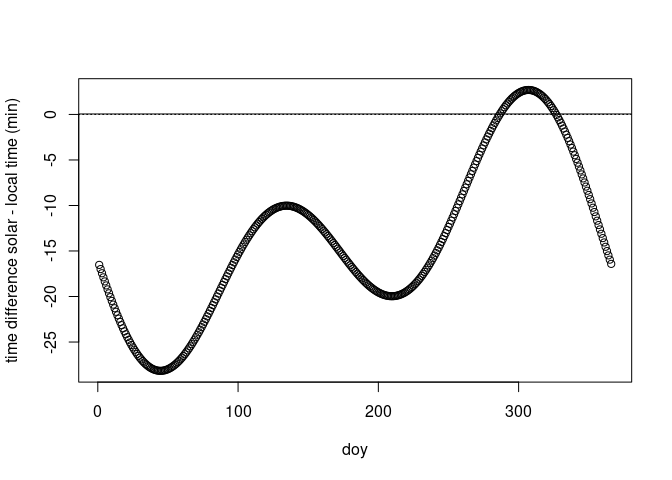

<!-- 
README.md is generated from README.Rmd. Please edit that file
rmarkdown::render("README.Rmd") 
-->
<!-- badges: start -->

[](http://cran.r-project.org/package=solartime)
[](https://github.com/bgctw/solartime/actions)
<!-- badges: end -->

## Overview

The `solartime` package provides utilities to work with solar time,
i.e. where noon is exactly when sun culminates. It provides functions to
compute

-   difference between local time zone and solar time
-   sun position
-   sunrise, sunset, daylength, and daytime flags

## Installation

``` r
# From CRAN (in future)
#install.packages("solartime")

# Or the the development version from GitHub:
# install.packages("devtools")
devtools::install_github("bgctw/solartime")
```

## Usage

The city of Jena is located west of the timezone’s meridian. Hence, the
sun culminates around 13 minutes later.

The time difference shifts during the year because of [earth orbit’s
eccentricity](https://en.wikipedia.org/wiki/Orbital_eccentricity).

``` r
require(solartime, quietly = TRUE)
latDeg <- 50.93; longDeg <- 11.57
doy <- 1:366
locaDiffMin <- 60 * computeSolarToLocalTimeDifference(
  longDeg, timeZone = 1L, doy = doy)
plot(locaDiffMin  ~ doy, ylab = "time difference solar - local time (min)")
abline(h = localDiff); abline(h = 0, lty = "dotted")
```

<!-- -->

See the [package
vignettes](https://github.com/bgctw/solartime/tree/master/vignettes)
(\*.md) for further examples.
